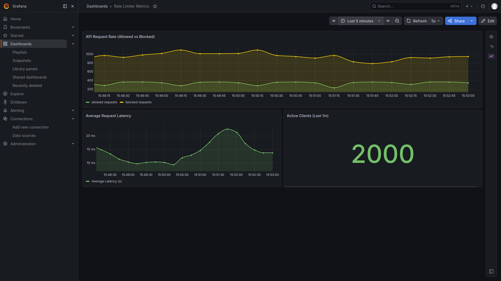
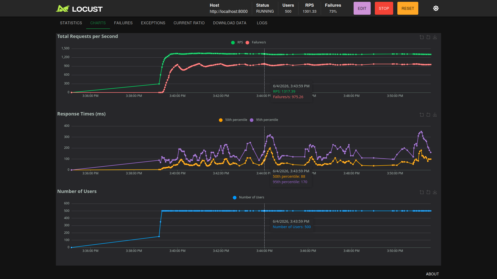

# Distributed Rate Limiter

A scalable, distributed rate-limiting API built with FastAPI and Redis, complete with built-in observability using Prometheus and Grafana.

## Architecture

This project is built using a modern microservices stack and orchestrated with Docker Compose:

- **FastAPI**: The core web framework serving the API.
- **Redis**: The centralized, in-memory data store used to share rate-limiting state across multiple API replicas.
- **Prometheus**: A time-series database configured to continuously scrape request metrics (allowed vs. blocked) from the API.
- **Grafana**: A visualization layer connected to Prometheus for building real-time dashboards of API traffic and rate-limit events.

## Prerequisites

- [Docker](https://docs.docker.com/get-docker/)
- [Docker Compose](https://docs.docker.com/compose/install/)

## Quickstart

1. **Clone the repository** (if you haven't already) and navigate to the project directory:
   ```bash
   cd dstrtlmt
   ```

2. **Start the infrastructure**:
   ```bash
   sudo docker compose up -d
   ```
   *Note: This spins up 2 replicas of the API, along with Redis, Prometheus, and Grafana.*

3. **Verify the services are running**:
   ```bash
   sudo docker ps
   ```
   You should see 5 containers running. The API replicas will be bound to host ports `8000` and `8001`.

## Testing the Rate Limiter

The application is configured to limit requests (e.g., 10 requests per 60 seconds per client). Because the state is stored in Redis, the limit is strictly enforced regardless of which API replica receives the request.

### Manual Testing
You can simulate traffic and trigger the rate limit by running this simple bash loop:

```bash
for i in {1..15}; do curl -s http://localhost:8000/ > /dev/null; echo "Request $i sent"; done
```
You should notice that after the configured limit is reached, the API will start returning `429 Too Many Requests` or a blocked response.

### Load Testing with Locust
To properly test the system's capacity and unique client tracking, we use **Locust**:

1. Activate your Python virtual environment and install Locust (already in `requirements.txt`):
   ```bash
   source .venv/bin/activate
   pip install locust
   ```
2. Run the load test using our pre-configured script:
   ```bash
   locust -f locustfile.py
   ```
3. Open `http://localhost:8089` in your browser, enter the number of users/spawn rate, and start the test to watch the metrics flow into Grafana.

## Performance & Load Testing

To validate the scalability of the distributed rate limiter, the system was stress-tested using **Locust** simulating 500 concurrent users across 2,000 unique active clients. The metrics were visualized in real-time using **Prometheus and Grafana**.

**Test Results:**
* **Load Volume:** Sustained 500 concurrent users mimicking 2,000 unique active clients via randomized API keys.
* **Total Throughput:** Handled a peak throughput of **~1,300 Requests Per Second (RPS)** across 2 distributed FastAPI instances.
* **Rate Limiting Efficiency:** Successfully throttled traffic at a **73% block rate** (~975 req/s blocked vs ~300 req/s allowed), preserving backend stability.
* **Latency:** Maintained a median (p50) response time of **88ms**, with a 95th percentile (p95) latency of **170ms** under maximum load. Internal app-to-Redis middleware processing overhead averaged a tight 10ms to 20ms.

### Observability Dashboards

*(Grafana Dashboard showing allowed vs blocked requests and p95 latency)*



*(Locust load testing results showing RPS and user growth)*



## Observability & Monitoring

The API exposes metrics at the `/metrics` endpoint. 

### Prometheus
- **URL**: [http://localhost:9090](http://localhost:9090)
- You can query raw metrics here. Try searching for `ratelimiter_requests_total` to see the raw counts of allowed and blocked requests.

### Grafana
- **URL**: [http://localhost:3000](http://localhost:3000)
- **Login**: `admin` / `admin` (Configured via `docker-compose.yml`)
- **Setup**: Zero-touch! We use **Infrastructure as Code (Provisioning)**. The Prometheus data source and the "Rate Limiter Metrics" dashboard are automatically loaded when the container starts.

**The pre-configured Dashboard tracks:**
1. **API Request Rate**: Total allowed vs blocked requests over time.
2. **Average Request Latency**: The average response time of the FastAPI replicas.
3. **Active Clients**: The count of unique clients (`client_key`) making requests within the last minute.
